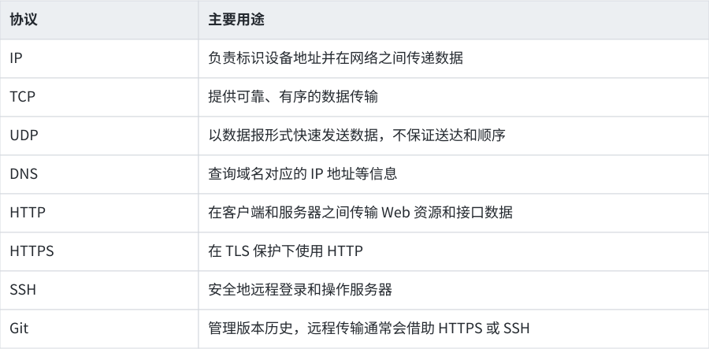
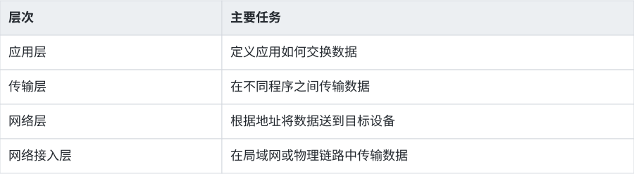
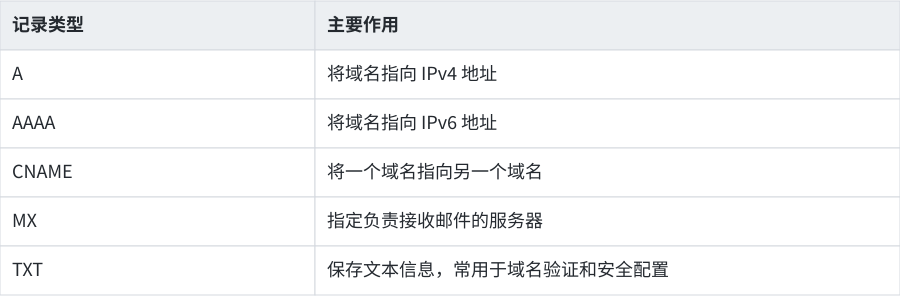
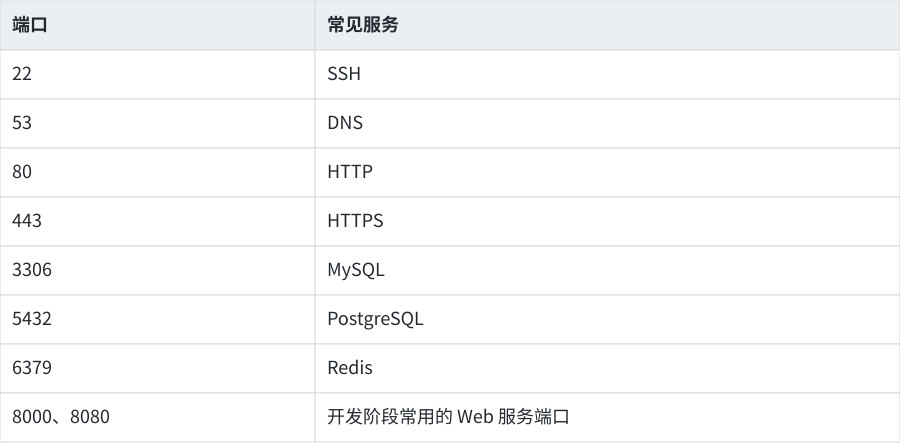
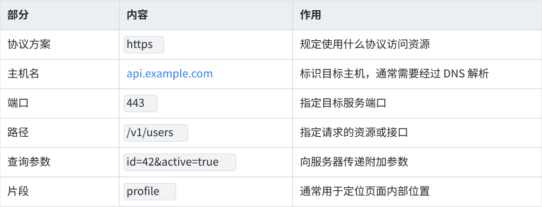
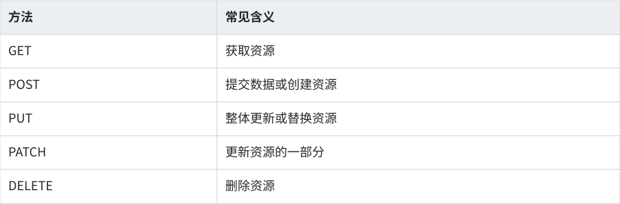
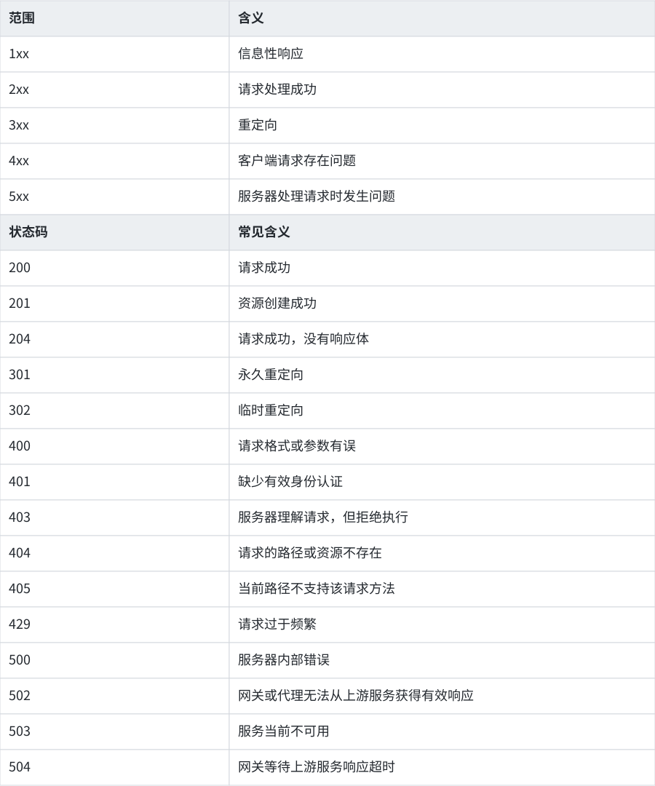
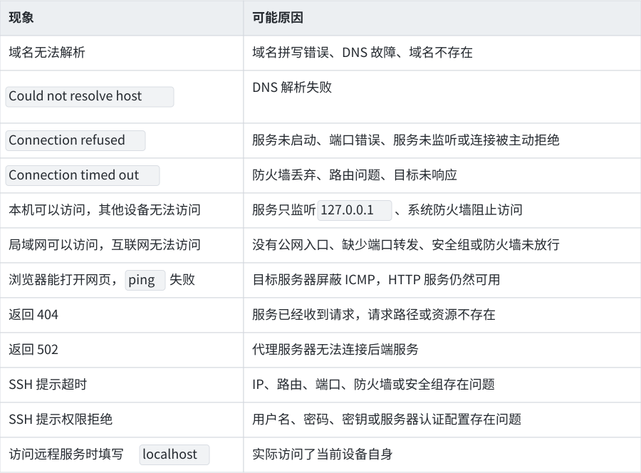

# 网络基础

在后续学习中，你会频繁遇到 git clone 失败、依赖下载超时、网页无法访问、API 返回错误、SSH 连接服务器失败等问题。这些问题看起来各不相同，背后通常都与域名解析、IP 地址、端口、网络协议或服务状态有关。

本节不会要求你背诵复杂的网络分层模型，学习重点是建立一套能够支持开发和服务器操作的基础认知，并学会通过命令判断问题发生在哪个环节。

## 1. 本节学习目标

完成本节后，你应当能够：

- 区分互联网、Web、客户端和服务器；
- 理解 IP 地址、域名、DNS、端口和 URL 的关系；
- 理解 TCP、UDP、HTTP、HTTPS 和 SSH 分别解决什么问题；
- 使用命令查看本机网络信息、查询域名、测试连接和观察端口；
- 根据错误现象，初步判断问题发生在 DNS、网络、端口还是应用程序。
## 2. 从访问一个网站开始

当你在浏览器中输入：

代码块
```{code-block} text
:linenos:

https://example.com/docs/index.html
```

随后按下回车，浏览器通常会依次完成以下工作：

1. 解析 URL，识别协议、域名、端口和资源路径；
2. 通过 DNS 查询 example.com 对应的 IP 地址；
3. 根据 IP 地址寻找目标服务器；
4. 与服务器建立网络连接；
5. 如果使用 HTTPS，先建立经过 TLS 保护的安全连接；
6. 向服务器发送 HTTP 请求；
7. 服务器处理请求并返回 HTTP 响应；
8. 浏览器读取 HTML，并继续请求页面所需的 CSS、JavaScript、图片等资源；
9. 浏览器组合这些资源并显示网页。

可以将整个过程简化为：

代码块
```{code-block} text
:linenos:

URL
↓
DNS 查询域名对应的 IP
↓
连接目标 IP 和端口
↓
建立 TCP 或 QUIC 连接
↓
HTTPS 场景下进行 TLS 握手
↓
发送 HTTP 请求
↓
服务器处理请求
↓
返回 HTTP 响应
↓
浏览器显示页面
```

以后排查网络问题时，也应按照这条链路逐步检查，而不是看到“无法访问”就反复重启软件或重新安装环境。

## 3. 网络中的基本角色

### 3.1 客户端

客户端是主动发起请求的一方，例如：

- 浏览器；
- 手机应用；
- curl 命令；
- Git 客户端；
- 调用大模型接口的 Python 程序；
- 通过 SSH 连接服务器的终端。

客户端并不局限于个人电脑。任何主动向其他程序请求资源或服务的软件，都可以充当客户端。

### 3.2 服务器

服务器是接收请求并提供服务的一方，例如：

- 返回网页的 Web 服务器；
- 保存数据的数据库服务器；
- 提供模型推理能力的 API 服务器；
- 接受远程登录的 SSH 服务器；
- 提供文件下载的文件服务器。

“服务器”描述的是一种角色。它可以是一台机房中的物理设备，也可以是云服务器、虚拟机、容器，甚至可以是运行在你自己电脑上的一个程序。

同一台电脑也可以同时充当客户端和服务器。例如，你在电脑上运行一个本地 Web 服务，再通过浏览器访问它，此时浏览器是客户端，本地 Web 服务是服务器。

### 3.3 请求与响应

多数网络应用都遵循“请求—响应”模式：

代码块
```{code-block} text
:linenos:

客户端发送请求 → 服务器处理请求 → 服务器返回响应
```

例如，浏览器请求一个网页：

代码块
```{code-block} text
:linenos:

浏览器：请把 /index.html 发给我
服务器：请求成功，这是文件内容
```

调用大模型 API 也是类似过程：

代码块
```{code-block} text
:linenos:

程序：请根据这段输入生成回答
模型服务：请求成功，这是生成结果
```

## 4. 协议：网络通信的共同规则

两台设备即使能够连接，如果使用的通信规则不同，仍然无法正确交换信息。协议规定了数据如何组织、发送、接收和解释。

开发中常见的协议包括：



为方便理解，我们可以将这些复杂的概念简化为四个层次：



学习开发时不需要立即掌握每层的全部细节。你需要先知道：一次应用请求需要经过多个环节，任何一个环节出现问题，最终都可能表现为“连接失败”。

## 5. IP 地址：找到目标设备

### 5.1 什么是 IP 地址

IP 地址用于标识网络中的一个网络接口。常见的 IPv4 地址如下：

代码块
```{code-block} text
:linenos:

192.168.1.25
8.8.8.8
```

IPv4 地址由四组十进制数字组成，每组范围是 0 到 255 。

你也可能看到包含冒号的 IPv6 地址：

```{code-block} text
:linenos:

2001:db8::1
```

### 5.2 一台电脑可能有多个 IP 地址

不要把“一台电脑只有一个 IP”当成固定规则。电脑可能同时存在：

- Wi-Fi 网卡地址；
- 有线网卡地址；
- VPN 创建的虚拟网卡地址；
- Docker 或虚拟机创建的虚拟网络地址；
- IPv4 地址；
- IPv6 地址；
- 回环地址。

因此，查看网络信息时可能出现多个 IP。你需要结合网卡名称和地址范围判断哪一个正在使用。

### 5.3 公网 IP 和私有 IP

公网 IP 可以在互联网中被路由，通常由网络运营商或云服务商分配。

私有 IP 主要用于家庭、学校、公司和云平台内部网络。常见的 IPv4 私有地址范围包括：

代码块
```{code-block} text
:linenos:

10.0.0.0      ～ 10.255.255.255
172.16.0.0    ～ 172.31.255.255
192.168.0.0   ～ 192.168.255.255
```

例如：

代码块
```{code-block} text
:linenos:

192.168.1.20
10.10.0.5
172.20.4.8
```

这些通常都是私有 IP。

多个家庭或学校可以同时使用相同的私有 IP，因为这些地址只需要在各自的内部网络中保持可区分。

### 5.4 回环地址与 localhost

下面两个地址通常表示当前设备自身：

```{code-block} text
:linenos:

127.0.0.1
localhost
```

它们经常用于访问运行在本机上的服务，例如：

代码块
```{code-block} text
:linenos:

http://127.0.0.1:3000
http://localhost:8080
```

需要特别注意： localhost 永远指向执行访问操作的那台设备。

假设 Web 服务运行在实验室服务器上，你在自己的电脑浏览器中访问：

代码块
```{code-block} text
:linenos:

http://localhost:8000
```

浏览器寻找的是你自己电脑的 8000 端口，不会自动寻找实验室服务器。

访问远程服务器需要使用服务器的 IP 地址或域名：

代码块
```{code-block} text
:linenos:

http://192.168.1.50:8000
```

或者：

代码块
```{code-block} text
:linenos:

https://api.example.com
```

### 5.5 0.0.0.0 的含义

在服务器监听配置中，常见以下两种写法：

代码块
```{code-block} text
:linenos:

127.0.0.1:8000
0.0.0.0:8000
```

它们的含义不同：

- 监听 127.0.0.1 ：通常只有本机可以访问；
- 监听 0.0.0.0 ：监听当前设备的所有 IPv4 网络接口。

0.0.0.0 主要用于服务的监听配置，通常不作为浏览器访问服务器时填写的目标地址。

例如，一个服务显示：

代码块
```{code-block} text
:linenos:

Listening on 0.0.0.0:8000
```

其他设备访问时仍需填写服务器的实际 IP：

代码块
```{code-block} text
:linenos:

http://192.168.1.50:8000
```

### 5.6 子网和默认网关

子网可以理解为一个局部网络范围。同一宿舍、实验室或家庭路由器下的设备通常处于同一个局域网中。

你可能看到下面的写法：

代码块
```{code-block} text
:linenos:

192.168.1.25/24
```

其中 /24 表示前 24 位用于标识网络范围。当前阶段不要求进行子网计算，只需要知道它用于判断哪些设备位于同一网络。

默认网关通常是路由器在当前局域网中的地址，例如：

代码块
```{code-block} text
:linenos:

192.168.1.1
```

当电脑需要访问局域网之外的地址时，会把数据交给默认网关继续转发。

## 6. NAT 与防火墙

### 6.1 NAT

家庭或学校中的设备通常使用私有 IP，路由器会通过 NAT 将多个内部设备的通信映射到外部网络。一个简化的过程如下：

代码块
```{code-block} text
:linenos:

电脑 192.168.1.20
↓
家庭路由器进行地址转换
↓
公网地址
↓
互联网服务器
```

这也是多个设备能够共享一个外部网络连接的重要原因。

### 6.2 为什么有公网 IP 仍可能无法访问服务

服务器拥有公网 IP，只说明网络中存在一个可以被路由的地址。外部用户能否访问某个服务，还取决于：

- 服务程序是否正在运行；
- 服务是否监听正确的网络接口；
- 端口是否正确；
- 操作系统防火墙是否放行；
- 云平台安全组是否放行；
- 路由器是否完成端口转发；
- 上级网络是否使用了额外的 NAT；
- 应用程序是否正确处理请求。

因此，“有公网 IP”等于“可以从任意位置直接访问”的判断并不成立。

### 6.3 防火墙

防火墙根据规则决定哪些网络连接可以通过。例如：

代码块
```{code-block} text
:linenos:

允许外部访问 TCP 端口 22
允许外部访问 TCP 端口 443
拒绝外部访问数据库端口 3306
```

防火墙可以存在于多个位置：

- 个人电脑操作系统；
- Linux 服务器；
- 家庭路由器；
- 学校或公司网络；
- 云服务器安全组；
- 容器或集群网络。

排查连接问题时，需要明确网络请求经过了哪些防火墙。

## 7. 域名与 DNS

### 7.1 为什么需要域名

IP 地址适合计算机处理，却不方便人类记忆。域名为网络服务提供了更容易识别的名称，例如：

代码块
```{code-block} text
:linenos:

github.com
swu.edu.cn
example.com
```

### 7.2 DNS 的作用

DNS 可以理解为网络中的分布式地址查询系统。客户端通常需要先通过 DNS 查询域名对应的 IP 地址：

代码块
```{code-block} text
:linenos:

example.com → 93.184.216.34
```

实际情况可能更复杂：

- 一个域名可以对应多个 IP；
- 多个域名可以指向同一个 IP；
- 不同地区可能解析出不同地址；
- DNS 结果可能被电脑、浏览器或网络服务商缓存；
- 域名还可以保存邮件服务器等其他类型的信息。
### 7.3 常见 DNS 记录



### 7.4 DNS 出现问题时的表现

DNS 故障可能表现为：

- 输入域名无法访问；
- 直接使用 IP 地址可以访问；
- git clone 提示无法解析主机名；
- curl 提示 Could not resolve host ；
- 浏览器提示域名不存在或 DNS 解析失败。

此时应优先使用 nslookup 或 dig 检查域名解析，而不是直接修改项目代码。
## 8. 端口：找到设备上的具体服务

### 8.1 为什么有了 IP 还需要端口

一台服务器可以同时运行多个服务：

代码块
```{code-block} text
:linenos:

SSH 服务
Web 服务
数据库服务
模型推理服务
文件服务
```

IP 地址负责找到目标设备，端口负责找到目标设备上的具体服务。

可以使用下面的类比：

代码块
```{code-block} text
:linenos:

IP 地址 = 一栋建筑的地址
端口 = 建筑中的房间号
```

一个完整的网络连接目标通常由 IP 和端口共同组成：

代码块
```{code-block} text
:linenos:

192.168.1.50:8000
```

### 8.2 端口范围

端口号范围为：

代码块
```{code-block} text
:linenos:

0 ～ 65535
```

常见端口包括：



这些端口是常见约定，程序也可以配置为使用其他端口。例如，SSH 服务可以从默认的 22 端口改到2222。

### 8.3 监听端口

服务启动后，需要监听一个端口才能接收连接。例如：

代码块
```{code-block} text
:linenos:

Web server listening on 0.0.0.0:8000
```

这表示服务正在所有 IPv4 网络接口的 8000 端口等待连接。

如果程序没有启动，或者启动后没有监听对应端口，客户端可能看到：

代码块
```{code-block} text
:linenos:

Connection refused
```

端口能够建立连接也不代表应用一定正常。程序仍可能返回 500 、 503 等应用层错误。

## 9. URL 的结构

观察下面的 URL：

代码块
```{code-block} text
:linenos:

https://api.example.com:443/v1/users?id=42&active=true#profile
```

它可以拆分为：



完整结构可以写成：

代码块
```{code-block} text
:linenos:

协议://主机:端口/路径?查询参数#片段
```

### 9.1 默认端口

HTTP 和 HTTPS 通常分别使用：

代码块
```{code-block} text
:linenos:

HTTP → 80
HTTPS → 443
```

使用默认端口时，URL 可以省略端口：

代码块
```{code-block} text
:linenos:

https://example.com
```

等价于：

代码块
```{code-block} text
:linenos:

https://example.com:443
```

### 9.2 查询参数不是安全存储位置

查询参数可能出现在：

- 浏览器历史记录；
- 服务器访问日志；
- 代理服务器日志；
- 分析平台记录；
- 分享出去的完整链接中。

因此，不应直接在 URL 查询参数中放置密码、私钥或长期有效的访问令牌。

### 9.3 路径不一定对应真实文件

下面的 URL：

代码块
```{code-block} text
:linenos:

https://api.example.com/users/42
```

其中 /users/42 可能由后端程序动态处理，并不代表服务器磁盘上真的存在一个名为 42 的文件。

## 10. TCP 与 UDP

### 10.1 TCP

TCP 提供面向连接、可靠、有序的数据传输。它会处理：

- 数据是否到达；
- 数据顺序是否正确；
- 丢失数据的重传；
- 发送速度的协调。

常见使用场景包括：

- SSH；
- Git 的 SSH 连接；
- HTTP/1.1；
- HTTP/2；
- 数据库连接。

TCP 更像一场需要先建立连接的持续对话。

### 10.2 UDP

UDP 以独立数据报的形式发送数据，协议本身不保证：

- 数据一定送达；
- 数据按原顺序到达；
- 数据只到达一次。

UDP 的协议开销较小，适合对实时性要求较高，或者由上层协议自行处理可靠性的场景，例如：

- 部分 DNS 查询；
- 实时音视频；
- 在线游戏；
- QUIC。

“UDP 一定比 TCP 快”属于过度简化。实际性能还会受到网络环境、应用设计、拥塞控制和丢包情况影响。

### 10.3 HTTP 与传输协议的关系

HTTP 是应用层协议，TCP、UDP 和 QUIC 位于更底层。

常见关系包括：

代码块
```{code-block} text
:linenos:

HTTP/1.1 → 通常运行在 TCP 上
HTTP/2 → 通常运行在 TCP 上
HTTP/3 → 运行在基于 UDP 的 QUIC 上
```

因此，不要把 HTTP 永久等同于 TCP。

## 11. HTTP 与 HTTPS

### 11.1 HTTP 请求

一个简化的 HTTP 请求如下：

代码块
```{code-block} text
:linenos:

GET /api/users?id=42 HTTP/1.1
Host: example.com
Accept: application/json
```

请求通常包含：

- 请求方法；
- 请求路径；
- 请求头；
- 可选的请求体。
### 11.2 常见请求方法



### 11.3 HTTP 响应

一个简化的响应如下：

代码块
```{code-block} text
:linenos:

HTTP/1.1 200 OK
Content-Type: application/json
{"id":42,"name":"Alice"}
```

响应通常包含：

- 状态码；
- 响应头；
- 可选的响应体。
### 11.4 HTTP 状态码

状态码用于描述服务器处理请求的结果：



看到状态码意味着请求通常已经到达某个 HTTP 服务。此时继续检查网络连接的意义较小，应转向检查 URL、参数、权限、代理配置和服务日志。

### 11.5 HTTPS

HTTPS 可以理解为运行在 TLS 安全连接上的 HTTP。TLS 主要提供：

- 传输内容加密；
- 数据完整性保护；
- 对服务器身份进行验证。

HTTPS 可以降低数据在传输途中被窃听或篡改的风险。

浏览器显示安全连接，只能说明当前连接经过加密，并且证书验证通过。它无法保证网站提供的内容一定真实、合法或值得信任。

## 12. SSH

SSH 用于通过加密连接远程登录和管理服务器。

基本格式为：

代码块
```{code-block} text
:linenos:

ssh 用户名@服务器地址
```

例如：

代码块
```{code-block} text
:linenos:

ssh student@192.168.1.50
```

指定非默认端口：

```{code-block} text
:linenos:

ssh student@192.168.1.50 -p 2222
```

一次 SSH 连接至少涉及：

代码块
```{code-block} text
:linenos:

服务器地址 + SSH 端口 + 用户身份 + 身份验证方式
```

因此，SSH 失败时应分别检查：

- 域名是否能够解析；
- IP 是否正确；
- 端口是否正确；
- SSH 服务是否运行；
- 防火墙或安全组是否放行；
- 用户名是否正确；
- 密码或密钥是否正确。

此处需要注意：在后续实验过程中，实验室服务器的地址均为内网，需要在校园网或者 VPN 的情况下才能访问！

## 13. 使用命令观察网络

不同操作系统的命令存在差异。执行命令时只需要选择与你当前系统对应的一项。

### 13.1 查看本机 IP 和默认网关

Windows：

代码块
```{code-block} text
:linenos:

ipconfig
```

重点观察：

代码块
```{code-block} text
:linenos:

IPv4 Address
Default Gateway
```

macOS：

代码块
```{code-block} text
:linenos:

networksetup -getinfo Wi-Fi
```

也可以查看全部网络接口：

代码块
```{code-block} text
:linenos:

ifconfig
```

Linux：

代码块
```{code-block} text
:linenos:

ip addr
ip route
```

重点观察：

- 当前网卡名称；
- inet 后面的 IPv4 地址；
- default via 后面的默认网关。
### 13.2 查询域名

Windows、macOS 和多数 Linux 环境都可以使用：

代码块
```{code-block} text
:linenos:

nslookup example.com
```

macOS 和安装了相关工具的 Linux 还可以使用：

代码块
```{code-block} text
:linenos:

dig example.com
```

你需要重点观察：

- 查询是否成功；
- 返回了哪些 IP 地址；
- 返回的是 IPv4 还是 IPv6；
- 是否出现找不到域名或查询超时。
### 13.3 使用 ping 测试基本连通性

Windows：

代码块
```{code-block} text
:linenos:

ping example.com
```

macOS 和 Linux：

代码块
```{code-block} text
:linenos:

ping -c 4 example.com
```

ping 可以观察：

- 域名是否成功解析；
- 是否收到目标返回的数据；
- 网络往返延迟；
- 是否存在丢包。

部分服务器、防火墙和网络会主动屏蔽 ping 使用的 ICMP 数据。 ping 失败不能直接证明网站或服务器不可用。
### 13.4 查看数据经过的路径

Windows：

代码块
```{code-block} text
:linenos:

tracert example.com
```

macOS 和 Linux：

代码块
```{code-block} text
:linenos:

traceroute example.com
```

该命令可以显示数据前往目标过程中经过的部分网络节点。一些节点不会响应探测数据，因此出现 * 不一定代表网络在该位置彻底中断。

### 13.5 使用 curl 发送 HTTP 请求

查看响应头：

代码块
```{code-block} text
:linenos:

curl -I https://example.com
```

查看详细连接过程：

代码块
```{code-block} text
:linenos:

curl -v https://example.com
```

保存返回内容：

代码块
```{code-block} text
:linenos:

curl https://example.com -o page.html
```

curl -v 通常可以帮助观察：

- DNS 解析出的地址；
- 尝试连接的 IP 和端口；
- TLS 连接过程；
- HTTP 请求头；
- HTTP 响应头；
- 状态码。

如果终端提示没有 curl ，可以暂时跳过，在后续“开发环境管理”中完成安装。
### 13.6 测试指定端口

Windows PowerShell：

代码块
```{code-block} text
:linenos:

Test-NetConnection example.com -Port 443
```

macOS 或安装了 Netcat 的 Linux：

代码块
```{code-block} text
:linenos:

nc -vz example.com 443
```

可能看到的结果包括：

代码块
```{code-block} text
:linenos:

succeeded
Connection refused
Operation timed out
```

常见解释：

- succeeded ：TCP 连接成功建立；
- Connection refused ：目标设备通常可以到达，目标端口没有服务监听，或者连接被主动拒绝；
- timed out ：数据可能被防火墙丢弃、路由不可达，或目标长时间没有响应。

这些解释用于初步定位，复杂网络环境中仍需要结合其他信息判断。

### 13.7 查看本机正在监听的端口

Windows：

代码块
```{code-block} text
:linenos:

netstat -ano
```

macOS：

代码块
```{code-block} text
:linenos:

lsof -nP -iTCP -sTCP:LISTEN
```

Linux：

代码块
```{code-block} text
:linenos:

ss -lntp
```

常见监听结果可能类似：

代码块
```{code-block} text
:linenos:

127.0.0.1:3000
0.0.0.0:8000
```

需要重点判断：

- 进程是否正在监听预期端口；
- 服务监听在 127.0.0.1 还是 0.0.0.0 ；
- 使用的是 IPv4 还是 IPv6；
- 端口是否被其他程序占用。
## 14. 浏览器开发者工具

终端命令能够观察网络连接，浏览器开发者工具则适合观察网页和 API 请求。

大多数浏览器可以通过以下方式打开开发者工具：

- Windows/Linux：按 F12 或 Ctrl + Shift + I ；
- macOS：按 Command + Option + I 。

打开后进入 Network 面板，再刷新网页。你通常可以看到：
- 请求 URL；
- 请求方法；
- HTTP 状态码；
- 请求头和响应头；
- 请求参数；
- 响应内容；
- 每个请求的耗时；
- 请求资源的类型和大小。

当网页显示异常时，优先检查：

1. 是否存在红色失败请求；
2. 请求 URL 是否正确；
3. 状态码是什么；
4. 响应内容是否包含错误信息；
5. 请求是否携带了正确的参数和身份信息。
## 15. 网络排错的基本顺序

遇到网络问题时，按照下面的顺序排查：

代码块
```{code-block} text
:linenos:

地址是否写对
↓
本机是否连接网络
↓
是否获得有效 IP 和默认网关
↓
DNS 是否能够解析域名
↓
目标 IP 是否可以到达
↓
目标端口是否能够连接
↓
服务是否正在监听
↓
HTTP 状态码是否正常
↓
应用参数、权限和程序逻辑是否正确
```

### 15.1 第一步：检查地址

先检查最容易出错的内容：

- 域名是否拼写错误；
- 使用了 http 还是 https ；
- 端口是否正确；
- URL 路径是否正确；
- 是否误用了 localhost ；
- SSH 用户名是否正确。
### 15.2 第二步：检查本机网络

查看本机是否获得了 IP 和默认网关：

代码块
```{code-block} text
:linenos:

ipconfig
```

或者：

```{code-block} text
:linenos:

ip addr
ip route
```

如果电脑没有获得有效地址，应先检查 Wi-Fi、有线网络、VPN 和网络认证。

### 15.3 第三步：检查 DNS

代码块
```{code-block} text
:linenos:

nslookup example.com
```

如果域名无法解析，优先检查：

- 域名是否存在；
- DNS 服务器是否可用；
- VPN 或代理是否影响 DNS；
- 本机 DNS 缓存是否异常；
- 当前网络是否限制该域名。
### 15.4 第四步：检查端口

代码块
```{code-block} text
:linenos:

curl -v https://example.com
```

或者：

代码块
```{code-block} text
:linenos:

nc -vz example.com 443
```

如果连接被拒绝，检查服务是否运行、端口是否配置正确。

如果连接超时，检查路由、防火墙、安全组、NAT 和网络访问限制。

### 15.5 第五步：检查 HTTP 状态

如果已经收到 HTTP 状态码，说明请求至少到达了某个 HTTP 服务。

此时根据状态码继续判断：

代码块
```{code-block} text
:linenos:

401 → 检查登录状态、Token 或密钥
403 → 检查权限和访问策略
404 → 检查请求路径
429 → 降低请求频率
500 → 检查服务端程序和日志
502 → 检查反向代理后的上游服务
503 → 检查服务是否启动或负载是否过高
504 → 检查上游服务响应时间和网络连接
```

### 15.6 第六步：检查服务进程和日志

在服务器上检查：

- 程序是否仍在运行；
- 程序是否监听预期端口；
- 监听地址是否正确；
- 端口是否被占用；
- 日志中是否有异常；
- 环境变量和配置文件是否正确。

网络连接正常，并不代表应用程序逻辑一定正常。

## 16. 常见现象与可能原因



## 17. 容易形成的错误认识

### 17.1 ping 不通就代表服务器宕机

ping 使用的 ICMP 可能被屏蔽。判断 Web 服务是否正常，应继续使用：

代码块
```{code-block} text
:linenos:

curl -I https://目标地址
```

或者测试具体端口。

### 17.2 一个域名只对应一台服务器

大型网站通常会使用多个 IP、多台服务器、负载均衡和内容分发网络。同一个域名可能在不同时间和地区解析出不同地址。

### 17.3 一个 IP 只能运行一个网站

多个域名可以指向同一个 IP，Web 服务器会根据请求中的主机名决定返回哪个网站。

### 17.4 开放端口就代表服务正常

端口能够连接只说明存在网络入口和监听程序。应用内部仍可能发生认证错误、数据库错误或程序异常。

### 17.5 HTTPS 代表网站内容绝对可信

HTTPS主要保护通信过程。恶意网站同样可以部署有效的 HTTPS 证书。

### 17.6 localhost 可以代表任意服务器

localhost 只代表当前执行请求的设备。不同电脑上的 localhost 指向不同设备。

## 18. 实践任务：观察一次完整的网络请求

使用 example.com 完成以下实验。

### 任务一：查询域名

代码块
```{code-block} text
:linenos:

nslookup example.com
```

记录：

- 是否查询成功；
- 返回了哪些 IP；
- 是否包含 IPv4 或 IPv6。
### 任务二：测试连通性

Windows：

代码块
```{code-block} text
:linenos:

ping example.com
```

macOS/Linux：

代码块
```{code-block} text
:linenos:

ping -c 4 example.com
#macOS也可使用简易的ping 而不加参数 但是需要手动暂停 否则会一直进行ping操作
```

记录：

- 是否能够收到回复；
- 平均延迟；
- 是否存在丢包。
### 任务三：发送 HTTP 请求

代码块
```{code-block} text
:linenos:

curl -I https://example.com
```

记录：

- HTTP 状态码；
- Content-Type ；
- Content-Length ；
- 服务器是否发生重定向。
### 任务四：观察详细连接过程

代码块
```{code-block} text
:linenos:

curl -v https://example.com
```

尝试找出：

- 连接的目标 IP；
- 使用的端口；
- 是否进行了 TLS 连接；
- HTTP 请求方法；
- HTTP 响应状态码。
### 任务五：使用浏览器开发者工具

1. 使用浏览器打开 https://example.com ；
2. 打开开发者工具；
3. 进入 Network 面板；
4. 刷新网页；
5. 找到主文档请求；
6. 查看请求 URL、请求方法、状态码、响应头和耗时。
### 提交内容

创建文件：

代码块
```{code-block} text
:linenos:

network-notes.md
```

按照下面的结构记录结果：

代码块
```{code-block} text
:linenos:

# 网络基础实践记录
## 1. 本机网络信息
- 操作系统：
- 本机 IPv4：
- 默认网关：
- 当前地址是否属于私有 IP：
## 2. DNS 查询
- 查询域名：
- 查询结果：
- 返回的 IP：
## 3. ping 测试
- 是否成功：
- 平均延迟：
- 是否丢包：
## 4. HTTP 请求
- 请求 URL：
- 请求方法：
- 状态码：
- Content-Type：
## 5. 问题思考
1. IP 地址和端口分别负责什么？
2. 为什么 ping 失败时网页仍可能正常打开？
3. localhost 指向哪台设备？
4. 404 和 Connection refused 分别说明请求到达了哪个阶段？
5. 一个服务在本机能够访问，其他设备无法访问，可能有哪些原因？
```

## 19. 本节知识检查

完成本节后，你应当能够解释下面这条链路：

代码块
```{code-block} text
:linenos:

域名
↓ DNS
IP 地址
↓
目标端口
↓ TCP、UDP 或 QUIC
应用服务
↓
HTTP 请求与响应
```

你还应当能够根据以下错误快速确定检查方向：

代码块
```{code-block} text
:linenos:

域名无法解析 → 检查 DNS
连接超时 → 检查路由、防火墙和目标状态
连接被拒绝 → 检查端口和服务监听
返回 401 或 403 → 检查身份和权限
返回 404 → 检查请求路径
返回 500 → 检查服务端代码和日志
返回 502 或 504 → 检查代理和上游服务
```

网络排错的核心并非记住大量命令，而是明确一次请求经过了哪些环节，再通过工具逐层缩小问题范围。

## 20. 参考资料

- MDN：万维网是如何工作的
- MDN：HTTP 概述
- RFC 9110：HTTP Semantics
- RFC 3986：URI Generic Syntax
- RFC 8499：DNS Terminology
- RFC 9293：Transmission Control Protocol
- RFC 768：User Datagram Protocol
- RFC 1918：Address Allocation for Private Internets
- IANA：Service Name and Transport Protocol Port Number Registry
- RFC 9846：TLS 1.3
